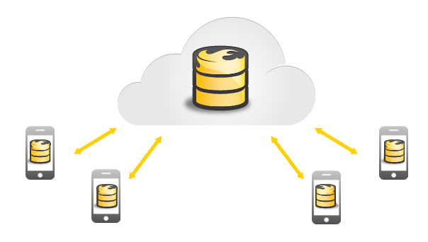
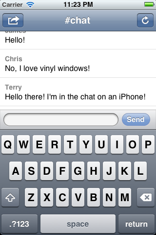

# FireChat

	Terry Worona

	Tweet me <a href="http://www.twitter.com/terryworona">@terryworona</a>

	Email me at <a href="mailto:terryworona@gmail.com">terryworona@gmail.com</a>

	

 

## Overview
---

*FireChat* is a simple chat client that interfaces with <a href="http://www.firebase.com/">Firebase</a>'s real-time scalable backend (primarily intended to be used with web-applications). *FireChat* is intended to prototype the capabilities of creating a truely native iOS application that interfaces with <a href="http://www.firebase.com/">Firebase</a>'s javascript library and service infrastructure.

 

	

 

## Web Hooks
---

FireChat's main communication pipeline is established through a UIWebView instance. The UIWebView instance is *not* added as a subview to any controller. It is retained as a communication channel allowing javascript hooks to pass data back and fourth between client and server.

## License
---

Copyright (C) 2012 Terry Worona

Permission is hereby granted, free of charge, to any person obtaining a copy of this software and associated documentation files (the "Software" ), to deal in the Software without restriction, including without limitation the rights to use, copy, modify, merge, publish, distribute, sublicense, and/or sell copies of the Software, and to permit persons to whom the Software is furnished to do so, subject to the following conditions:

The above copyright notice and this permission notice shall be included in all copies or substantial portions of the Software.

THE SOFTWARE IS PROVIDED "AS IS", WITHOUT WARRANTY OF ANY KIND, EXPRESS OR IMPLIED, INCLUDING BUT NOT LIMITED TO THE WARRANTIES OF MERCHANTABILITY, FITNESS FOR A PARTICULAR PURPOSE AND NONINFRINGEMENT. IN NO EVENT SHALL THE AUTHORS OR COPYRIGHT HOLDERS BE LIABLE FOR ANY CLAIM, DAMAGES OR OTHER LIABILITY, WHETHER IN AN ACTION OF CONTRACT, TORT OR OTHERWISE, ARISING FROM, OUT OF OR IN CONNECTION WITH THE SOFTWARE OR THE USE OR OTHER DEALINGS IN THE SOFTWARE.